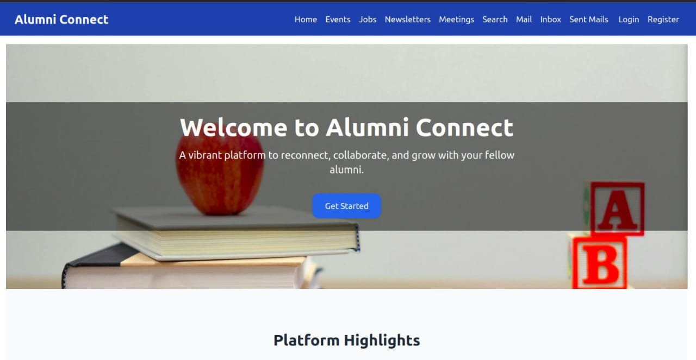

# 🎓 Alumni Connect Platform

A full-stack web application built to connect college alumni and students. This platform allows alumni to register, share job opportunities, view events, send newsletters, and communicate through emails — fostering a strong alumni network and student support system.

---

## 📸 Screenshots


| Home Page |
|-----------|
|  |


---

## 🔧 Features

- 👤 Alumni registration and login (secure auth)
- 📚 View and post job opportunities
- 🗓️ Event and meeting listings
- 📬 Send and receive emails (using Gmail IMAP + Nodemailer)
- 📖 Share newsletters with students and alumni
- 🔎 Search and filter alumni records
- 🎨 Modern UI built with React & Tailwind CSS

---

## 🛠️ Tech Stack

### Frontend:
- React.js
- React Router
- Axios
- Tailwind CSS

### Backend:
- Node.js
- Express.js
- MongoDB (with Mongoose)
- Nodemailer & IMAP-Simple
- dotenv

---

## 🚀 Getting Started

### 🔽 Clone the Repository

```bash
git clone https://github.com/BoyaManjula/alumni-connect.git
cd alumni-connect

▶️ Run the Application
Start Backend:

cd ../backend
npm start

Start Frontend:

cd ../frontend
npm start


📁 Folder Structure

alumni-connect/
│
├── backend/           # Express.js backend with MongoDB and email features
│   ├── server.js
│   ├── models/
│   └── routes/
│
├── frontend/          # React frontend with Tailwind CSS
│   ├── src/
│   └── public/
│
├── screenshots/       # Screenshots used in README
│   ├── home.png
│   └── directory.png
│
└── README.md


🔐 Environment Setup

Create a .env file in the backend/ folder and add the following:

PORT=5000
MONGO_URI=mongodb://127.0.0.1:27017/alumniDB
JWT_SECRET=your_jwt_secret_key
EMAIL_USER=your_email@gmail.com
EMAIL_PASS=your_email_app_password
